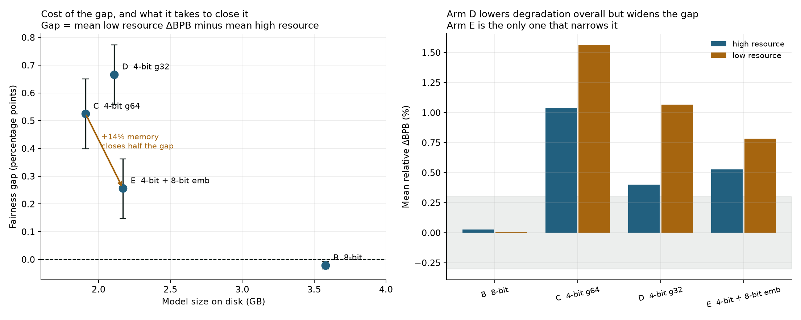
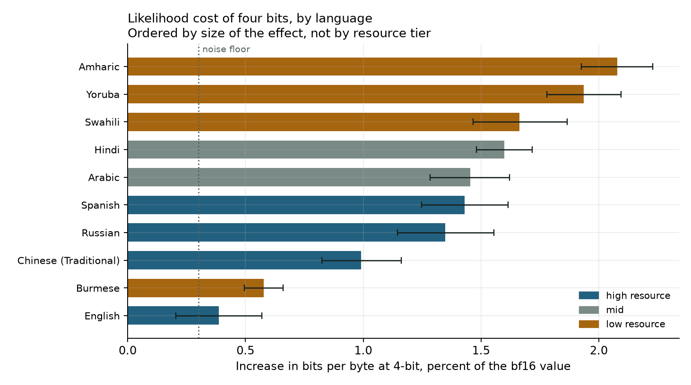
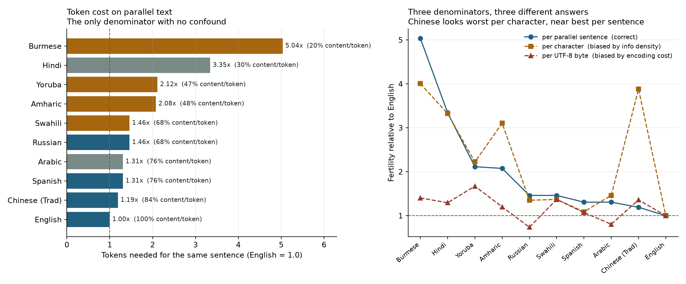
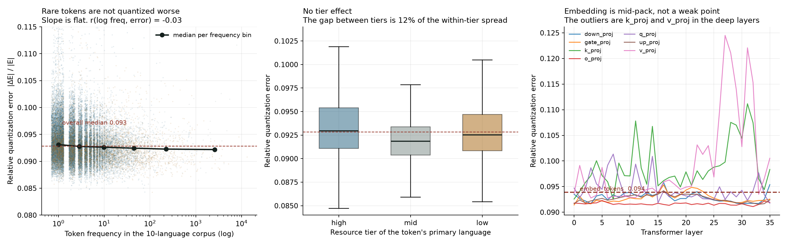
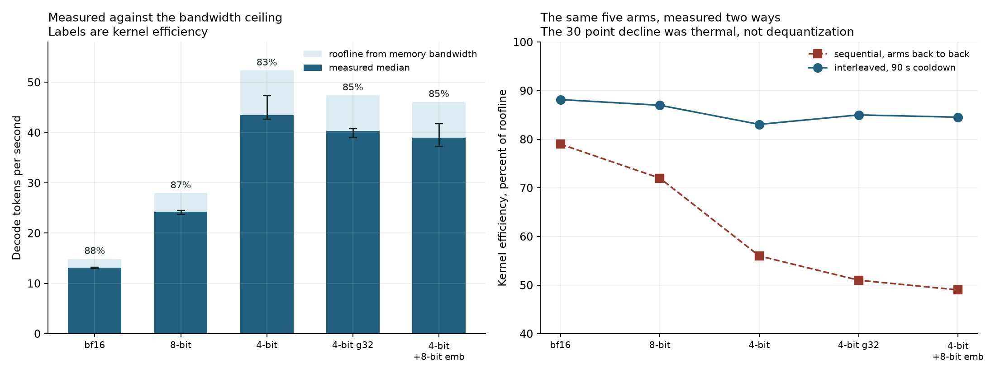
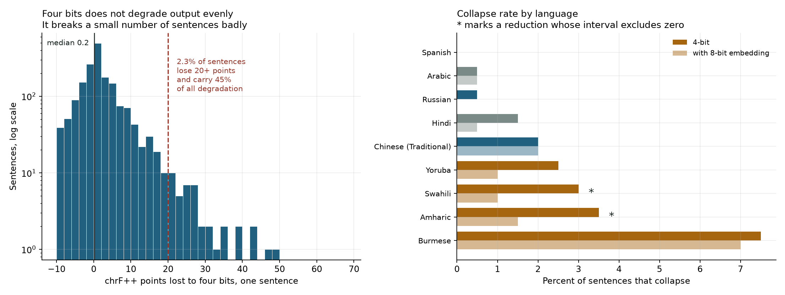
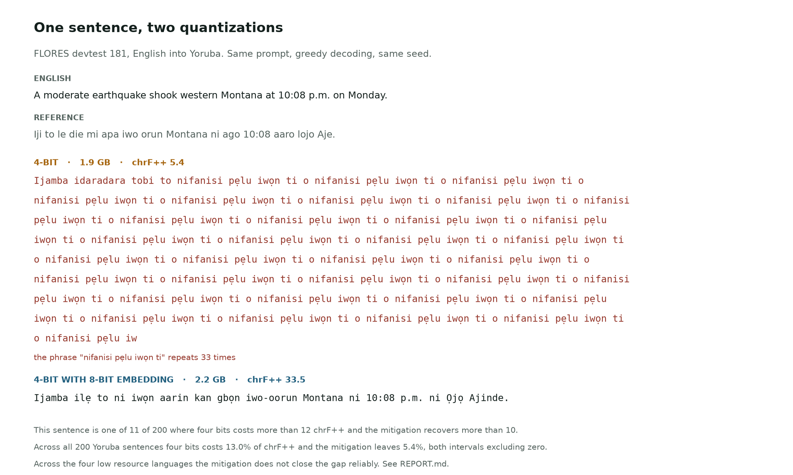
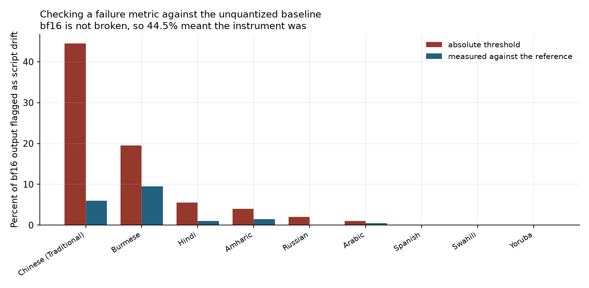

# Tiny Aya, ten languages, four bits

**What uniform 4-bit quantization costs each of ten languages on a fanless laptop, and whether a small change to the recipe can pay some of it back.**



Full write-up in [`REPORT.md`](REPORT.md). Method and the measurement checks in
[`METHODOLOGY.md`](METHODOLOGY.md). `make reproduce` runs the pipeline end to end.

## The question

[Tiny Aya](https://huggingface.co/CohereLabs/tiny-aya-global) is a 3.35B multilingual model from
Cohere Labs built to fit on a phone, and Cohere ships GGUF quantizations of it. In its real
deployment setting, quantization is not optional. It is the default state.

Almost every quantization evaluation is done in English. This model exists for the seventy languages
that nobody evaluates.

Hypotheses were registered in [`PREREGISTRATION.md`](PREREGISTRATION.md) before any evaluation was
run, and the commit history preserves that ordering. One of the two was supported, one failed on
statistical power, and the mechanism behind the one that worked turned out to be wrong.

There is a specific mechanism worth suspecting. The vocabulary is 262,144 entries wide because it has
to cover those seventy languages, so the embedding table alone is 537M parameters, sixteen percent of
the whole model. A lot of what the model knows about low resource languages lives in the sparse,
low frequency rows of that table. Does uniform 4-bit quantization treat those rows the same way it
treats the rest? That is directly measurable.

## Design

Five quantization arms, chosen so that each one answers a question the others cannot.

| Arm | Configuration | Size | What it isolates |
| --- | --- | --- | --- |
| A | bf16 | 6.72 GB | Baseline. Every delta is measured against it |
| B | 8-bit, g=64 | 3.58 GB | Is 8-bit really near lossless, in low resource languages too |
| C | 4-bit, g=64 | 1.91 GB | The configuration that actually gets deployed |
| D | 4-bit, g=32 | 2.11 GB | Separates bit depth from quantization granularity |
| E | 4-bit body, 8-bit embedding | 2.17 GB | Mitigation, at 14% more memory than C |

Ten languages, picked as a 2x2 so that resource level can be separated from writing system. Those two
factors are correlated in practice, and a reviewer will ask which one is doing the work.

| | Latin | Non-Latin |
| --- | --- | --- |
| **High resource** | English, Spanish | Russian, Chinese (Traditional) |
| **Mid** | | Hindi, Arabic |
| **Low resource** | Swahili, Yoruba | Amharic, Burmese |

Swahili is the load bearing choice. If low resource Latin languages degrade little while low resource
non-Latin ones degrade a lot, the driver is the script and not the resource level.

## Results


**8-bit is lossless everywhere**, including on the languages the model knows least well. Every language
falls inside ±0.15%, within the noise floor.

**Under 4-bit, degradation is uneven.** Amharic loses 2.08%, Yoruba 1.94%, Swahili 1.66%, and English
loses least of all ten at 0.39%. Averaged by tier: 1.04% high, 1.53% mid, 1.56% low. Among these ten
languages the gap is +0.52 percentage points, with a bootstrap interval of [+0.40, +0.65].

**Writing system does no work.** Latin averages 1.35% and non-Latin 1.34%. This is the comparison the
2x2 design was built to make, and it disagrees with the closest prior work, which found non-Latin
scripts took markedly more damage at 8B to 103B.

**Where the bits go matters more than how many.** Two arms three percent apart in size choose
oppositely:

| Arm | Size | Mean ΔBPB | Fairness gap |
| --- | --- | --- | --- |
| C, 4-bit g=64 | 1.91 GB | 1.346% | +0.52 pp |
| D, 4-bit g=32 | 2.11 GB | **0.612%** | **+0.67 pp** |
| E, 4-bit body, 8-bit embedding | 2.17 GB | 0.746% | **+0.26 pp** |

Arm D spends its extra half bit uniformly and buys the best average of any arm, while **widening** the
gap. Arm E spends a comparable amount on the embedding alone, gives up some average, and closes about
half the gap. An evaluation reporting only the mean would rank D above E.



### The registered tests

**The mitigation hypothesis was supported.** `gap(C) − gap(E)` is +0.269 pp with an interval of
[+0.201, +0.338], and shrinkage is 51.2% against a threshold of 50% set in advance. The claim that
survives without qualification is that arm E significantly narrows the gap; the shrinkage interval runs
from 40% to 65%, so "roughly half" is the defensible phrasing rather than "at least half".

**Its mechanism was wrong.** Weight-space error turned out to be uniform across languages and
frequencies, which falsified the reason arm E was expected to work. It works anyway. Low resource
languages are more sensitive to embedding perturbation than high resource ones even though the
perturbation is the same size, and explaining that is the next piece of work.

**The asymmetry hypothesis failed on power, not on effect.** The registered language-level regression
puts `tier_low` at +0.950 with an interval of [−0.448, +2.348]: six parameters on ten observations,
four residual degrees of freedom, an interval spanning 2.8 percentage points against an observed
difference of 0.5. The design could not have detected what it was looking for. That flaw was in the
plan from the beginning, since a language-level regression has as many observations as it has
languages. Fixing it takes more languages, not more sentences.

So: among these ten languages the gap is real and precisely estimated, and arm E reduces it. Beyond
these ten, nothing is established. Full numbers in [`docs/results.md`](docs/results.md).

## Two things measured along the way

### Token cost is not distributed evenly, before quantization enters



On parallel text, the same sentence costs Burmese about five times as many tokens as English. At an
equal decode rate, a Burmese user receives roughly a fifth of the content per second.

The right panel is the methodological point. Fertility has three plausible denominators and they
disagree. Per character, Chinese looks like one of the worst languages, but that is an artifact of
how much meaning a Han character carries. Per UTF-8 byte, Russian looks better than English, because
Cyrillic spends about 1.8 bytes per character and inflates the denominator. Only the parallel
sentence denominator is free of both.

This also bounds what bits-per-byte can claim, which is written up in
[`METHODOLOGY.md`](METHODOLOGY.md) section 2.1.
Byte normalization removes the tokenizer dependence, which is its job, but bytes still carry the
encoding cost of the script. Absolute BPB is therefore not a cross language quality scale. The
dependent variable here is within language ΔBPB, where the encoding cost cancels.

### Uniform quantization does not disadvantage rare tokens



The starting hypothesis was that rare tokens, which is where low resource language knowledge lives,
would be quantized worse. Measured directly in weight space, they are not.

Relative error `|ΔE|/|E|` is essentially constant at 0.093. In corpus tokens 0.0928, out of corpus
tokens 0.0929. High, mid and low resource tiers 0.0930, 0.0918, 0.0925. The correlation between
log frequency and error is −0.03. Ninety percent of tokens fall in a band 12.7% wide, and the largest
gap between tiers is 12% of that band, so this is a tight null rather than an underpowered one.

The reason is that affine quantization takes its scale from the min and max of each group of 64
weights, which makes it scale invariant. Relative error depends on the shape of the distribution
inside a group, not its magnitude. Per group scaling has already adapted to each row.

The evidence in fact runs the other way. Since relative error is fixed, absolute perturbation is set
by row norm, and English tokens have the largest embedding norms in this vocabulary.

This falsifies the weight space premise behind the mitigation hypothesis, and the behavioural result
above makes that outcome more interesting rather than less: **arm E works, and this is the reason it was
supposed to work, and the reason is wrong.** Whatever makes low resource languages more sensitive to
embedding precision, it is not that their rows carry more quantization error. Full write up in
[`docs/weight-space-error.md`](docs/weight-space-error.md).

One thing did stand out. The GQA key and value projections, the 512 dimensional matrices compressed
to four KV heads, carry the highest quantization error in the network, and `v_proj` gets worse with
depth, reaching 0.1245 at layer 27 against roughly 0.092 for the MLP blocks. That is a candidate
mechanism with nothing to do with embeddings, recorded as a post-hoc note rather than folded into the
registered hypotheses.


## What you get, and what you pay

Interleaved, 45 runs, medians with IQR, on mains power with the machine otherwise idle.

| Arm | Weights | Decode tok/s | IQR | Roofline | Efficiency |
| --- | --- | --- | --- | --- | --- |
| A bf16 | 6.72 GB | 13.1 | 12.9 to 13.2 | 14.9 | 88% |
| B 8-bit | 3.58 GB | 24.3 | 23.7 to 24.6 | 27.9 | 87% |
| C 4-bit | 1.91 GB | 43.5 | 42.7 to 47.4 | 52.4 | 83% |
| D 4-bit g32 | 2.11 GB | 40.3 | 39.0 to 40.8 | 47.4 | 85% |
| E mitigation | 2.17 GB | 39.0 | 37.3 to 41.8 | 46.1 | 85% |

Four bits buys 3.3 times the decode rate for a third of the memory. Kernel efficiency is flat at
83 to 88% across every bit width, which settles the question the smoke test could not: the
monotonic decline from 79% to 49% seen when the arms ran back to back was thermal, not
dequantization overhead. Interleaving collapses the spread from 30 percentage points to 5. The
registered check for a residual order effect finds none, so 90 seconds of cooldown was enough
(`order_idx` coefficient −0.008 tok/s per run, 95% CI [−0.057, +0.041], p = 0.75).



Quality, as within-language ΔBPB against bf16, four bits, 95% CI from a paired bootstrap over the
1012 parallel sentences:

| Language | Tier | ΔBPB | Language | Tier | ΔBPB |
| --- | --- | --- | --- | --- | --- |
| English | high | +0.39% | Arabic | mid | +1.45% |
| Burmese | low | +0.58% | Hindi | mid | +1.60% |
| Chinese | high | +0.99% | Swahili | low | +1.66% |
| Russian | high | +1.35% | Yoruba | low | +1.94% |
| Spanish | high | +1.43% | Amharic | low | +2.08% |


Eight bits is lossless everywhere, low resource languages included: every language sits within
±0.15%, inside the 0.3% noise floor established before the run.

## Was the cost distributed unequally

Yes for these ten languages, and the claim stops there.

On translation into each language, four bits costs low resource languages 8.2% of their chrF++
against 3.0% for high resource ones. The gap is 5.2 percentage points, 95% CI [−8.3, −2.2] from a
paired bootstrap over sentences. Plain chrF, which drops the whitespace-dependent word bigrams,
gives 4.6 points with 95% CI [−7.5, −1.6]. The conclusion does not depend on the metric.

**But the registered test does not support H1.** The preregistered regression works at the language
level, `Δ ~ tier + script + fertility + baseline`, and there are ten languages against six
parameters. The `tier` coefficient is +0.95 with a 95% CI of [−0.45, +2.35], four residual degrees
of freedom, adjusted R² negative. It cannot resolve an effect of this size, and that is a design
flaw that was in the plan from the beginning rather than a property of the data.

Both statements are true and they are not in tension. The sentence bootstrap says the gap among
these particular languages is real. The language-level regression says ten languages cannot
establish that it generalizes to low resource languages as a class. Reporting only the first would
be overclaiming; reporting only the second would be hiding a real measurement.

Two results survive that are worth more than the headline:

**Writing system does nothing.** Latin scripts lose 1.35% of BPB, non-Latin 1.34%. Marchisio et al.
found non-Latin scripts took roughly three times the damage at 8B to 103B. At 3.35B, on a model
built for these languages, the effect is absent. The 2x2 design exists precisely to separate script
from resource level, and it separates them.

**Baseline scores are not the explanation.** The usual objection to any finding like this is
regression to the mean, since low resource languages start lower. The correlation between relative
degradation and baseline BPB is −0.13. The covariate was in the preregistration to defuse that
objection, and the data defuses it independently.

## Does keeping the embedding at 8-bit help

Not enough to claim it.

| Metric | Gap at 4-bit | Gap with 8-bit embedding | Shrinkage |
| --- | --- | --- | --- |
| ΔBPB, primary | +0.53 pp | +0.26 pp | 51%, 95% CI [40, 66] |
| ΔchrF++, secondary | −5.23 pp | −3.99 pp | 24%, 95% CI [−50, 77] |

The registered rule asked for a difference whose CI excludes zero and at least half the gap closed.
On the primary metric both conditions are met, but by 1.2 percentage points, with an interval
reaching down to 40%. On the secondary metric the difference is −1.24 points with a 95% CI of
[−3.90, +1.44], which contains zero.

**Declaring H2 supported here would mean choosing the metric that agrees.** The honest reading is
that arm E helps selectively rather than generally: Yoruba recovers from −13.0% to −5.4% of chrF++,
both intervals excluding zero, while Burmese gets marginally worse, −8.9% to −10.2%. Fourteen
percent more memory buys a real improvement for some languages and nothing for others, and this
experiment cannot say which in advance.

The weight-space measurement had already falsified the premise behind the hypothesis. Relative
quantization error is flat at 0.093 across every language and frequency, so whatever arm E does for
Yoruba, it is not by fixing embedding rows that were quantized worse.

## The damage is a tail event, not a shift



This was found after the registered analysis was complete and is exploratory, but it reframes
everything above. The median sentence loses **0.2 chrF++** to four bits. Almost nothing. But 2.3% of
sentences lose at least twenty points, and those carry **45% of all degradation**. Collapse rate
tracks resource tier: 0.8% for high resource languages, 1.0% for mid, **4.1% for low**, reaching
7.5% for Burmese.

The registered analysis compares means, which is the right test for a shift in central tendency and
the wrong one for a change in how often something breaks.

The mitigation acts almost entirely on that tail: **+15.3 chrF++ on collapsed sentences against
+0.17 on everything else**, with 69% of its benefit coming from 2.3% of the data. Per language the
reduction in collapse rate excludes zero for Amharic and Swahili, two points each. Burmese, worst
affected, does not improve.

This explains three things that were puzzling. The wide intervals on H2, since a heavy-tailed effect
has high variance in its mean. The absence of any fidelity signal, since 200 sentences at a 2 to 7%
event rate gives five to fifteen events. And the gap between a 1.6% rise in bits per byte and an 8%
drop in chrF++, since BPB averages over every token and dilutes rare collapses.

What collapse looks like: degenerate repetition, refusal to translate, returning the English source
untouched, or fluent output about something else entirely. Real examples in
[`docs/failure-gallery.md`](docs/failure-gallery.md), or run them live with `python demo/compare.py`.

## What the failure looks like



`python demo/compare.py` runs this live, side by side, with tokens per second and peak memory
updating as each model generates. It takes about forty seconds.

The sentence was not chosen for effect. It is one of 11 of 200 Yoruba sentences where four bits
costs more than 12 chrF++ and the mitigation recovers more than 10, and the demo prints that
denominator on screen. A single dramatic failure is an anecdote until you say how often it happens.

## Failures that automatic metrics miss

The most interesting layer produced the least. After the metric was corrected, script drift,
language confusion and degenerate repetition give three intervals excluding zero across roughly
fifty uncorrected tests, which is what chance produces. The one coherent pattern is Yoruba
repetition, 0.5% at bf16, 3.5% at four bits with the interval excluding zero, 1.5% with arm E. It
points the same way as the chrF++ result, and one result among fifty is not a finding.

At n = 200 sentences per language this layer is underpowered for rates in the low single digits.
That is a statement about the experiment, not about the model.

An aside worth recording: the language detector covers seven of these nine languages. Amharic and
Burmese are absent from a 75-language detector, which is the same inequality this project set out
to measure, one layer further down the stack.

## What checking the baseline caught

Every failure proxy was run against bf16 first. An unquantized model should score near zero on any
measure of collapse, so a high baseline means the instrument is broken rather than the model.



Script drift flagged 44.5% of untouched Chinese output. The absolute threshold was counting proper
nouns, since Chinese references legitimately contain 802.11n and TogiNet. Measured against each
reference's own script share, the baseline falls to 6.0%.

mlx-lm emitted its stop token as text in 5329 of 5400 generations, depressing every chrF++ score.
Nothing followed the token, so stripping it is lossless.

The bootstrap that rebuilds corpus chrF from per-sentence statistics used the wrong reference shape
and returned zero-width confidence intervals. Aggregation is now asserted against `corpus_score` on
every extraction.

chrF++ adds whitespace-delimited word bigrams, which is meaningless for languages that do not
separate words with spaces. It costs Chinese 6.7 points and Burmese 8.1 against plain chrF. Both
metrics are reported. This is the same failure mode as perplexity: a metric carrying an unexamined
assumption about how writing works.

## Measuring speed on a machine with no fan

The first smoke test was run sequentially, A through E. Kernel efficiency against the memory
bandwidth roofline fell monotonically, 79%, 72%, 56%, 51%, 49%, in exactly the order the arms were
executed.

That is not enough to call it thermal throttling. Dequantization overhead also lowers efficiency at
lower bit widths, and sequential execution confounds the two beyond separation. The real measurement
protocol therefore shuffles all 45 runs under a fixed seed, forces a 90 second cooldown between them,
records `powermetrics` in the background, keeps `order_idx` in the results table so the residual
order effect can be tested afterwards, and reports medians with IQR rather than means.

Batching for the likelihood evaluation was checked the same way. Batched and unbatched results differ
by about 5e-3 per sequence, which had to be shown to be tiling rather than a padding leak: error is
non monotonic in padding amount, and a zero padding batch of two identical sequences produces the same
magnitude of difference. Aggregated over a thousand sentences the floor is about 1e-3, and any ΔBPB
below 0.3% is treated as noise. Both checks are in [`METHODOLOGY.md`](METHODOLOGY.md).

## Reproducing

Accept both licences while signed in to Hugging Face, then:

```bash
make setup                       # venv and dependencies
hf auth login
make reproduce                   # architecture checks, five arms, corpus, L0, L1, figures
make translate quality stats     # generation, scoring, the registered tests
```

`reproduce` takes about four hours on an M3 Air. `translate` takes about eight more and is the only
step that needs an otherwise idle machine, along with `speed`. Every stage skips work already on
disk, so an interrupted run continues rather than restarting.

`analysis/param_budget.py` derives the arm sizes from the config alone. Its predictions match the
converted models to within 1.5%, and its 5.141 bits per weight for arm E matches what mlx-lm reports.

## Limitations

**Ten languages cannot support a claim about low resource languages as a class.** The registered
regression has six parameters and ten observations. Every interval reported here that excludes zero
comes from resampling sentences with the language set held fixed, which is the right frame for "what
happened to these ten languages" and the wrong one for anything broader.

**One model, one machine.** Nothing here generalizes on its own. The obvious next step is a second
model at similar scale.

**No human evaluation.** Ten native speakers were not available, so language fidelity stands in as a
cheap proxy, and Traditional Chinese is the only language the author can spot check. The proxy is
also underpowered at 200 sentences for rates in the low single digits.

**The fidelity layer relies on tools with the same coverage gap.** The language detector supports
seven of the nine target languages.

**FLORES is news and encyclopedic text** and carries that domain bias. Resource tier is a coarse
discretization, assigned in advance and never adjusted.

**Speed figures describe sustained performance on a fanless M3 Air**, not an architectural ceiling.
Efficiency against roofline is uniform across bit widths on this machine and may not be on others.

## Prior work

The closest predecessor is Cohere's own
[How Does Quantization Affect Multilingual LLMs?](https://arxiv.org/abs/2407.03211)
(Marchisio et al., EMNLP Findings 2024), which covered 8B to 103B models and 23 languages and found
that automatic metrics badly understate the damage. The literature disagrees with itself:
[English K-quantization does not disproportionately diminish multilingual performance](https://arxiv.org/abs/2503.03592)
reaches the opposite conclusion on a different method and scale. This project sits at a smaller scale,
on lower resource languages, and tests a mitigation rather than only measuring.

## Licences

Tiny Aya is CC-BY-NC, research use only. FLORES+ is CC-BY-SA 4.0. No model weights or corpus files are
redistributed in this repository. Code here is MIT.
